# Xanze 架构说明

## 1. 文档状态

- 状态：目标架构，按阶段逐步实现
- 当前实现：阶段 1 企业基础底座
- 下一实现：阶段 2 AI 语义关系构建器
- 产品事实来源：`docs/PRODUCT_SPEC.md`

本文区分“已经实现”和“目标设计”。未进入代码、测试和验收脚本的能力不能视为已完成。

## 2. 总体架构原则

1. Java Core 是身份、权限、元数据、关系版本和业务写入的唯一事实来源。
2. Python Agent 负责数据分析、关系候选生成和模型调用，不直接连接业务数据库。
3. Web 只能通过 Core API 执行业务操作，不能把前端权限判断作为安全边界。
4. 原始只读数据、关系元数据、看板规格和可写业务对象是不同的数据域。
5. AI 输出始终是候选提案；Core 校验并经授权确认后才能形成已发布版本。
6. 任何阶段都以纵向闭环交付，不用空菜单表示未来能力。

## 3. 运行组件

### 3.1 Web

技术基线：React、TypeScript、Vite、Ant Design。

职责：

- 管理员和员工入口；
- 数据集、关系候选、证据和关系图展示；
- 人工接受、修改、拒绝和发布；
- 后续的表单、流程和看板运行界面。

Web 不保存权威权限、关系和发布状态。

### 3.2 Core

技术基线：Java、Spring Boot、Spring Security、MyBatis Plus、Flyway。

职责：

- 登录、用户、角色、组织和权限；
- 数据集登记和不可变版本；
- DataProfile、RelationProposal、SemanticRelation 和 RecordRelation 持久化；
- 关系状态机、版本、发布、审计和幂等；
- 对 Agent 请求进行数据裁剪和脱敏；
- 校验 Agent 返回的结构化结果；
- 后续业务对象、字段写入、流程和任务运行。

### 3.3 Agent

技术基线：Python、FastAPI、Pydantic。

职责：

- CSV/XLSX 安全解析和数据画像；
- 确定性关系发现；
- 关系证据、匹配率和异常样本计算；
- 调用配置的模型提供方进行业务语义解释；
- 按严格 Schema 返回 RelationProposal。

禁止：

- 持有 OceanBase 业务账号；
- 直接写入关系、业务记录或发布状态；
- 接收未经裁剪的全租户数据；
- 输出任意 SQL 供系统直接执行。

### 3.4 OceanBase

保存身份、权限、数据集元数据、画像、候选关系、正式关系、版本和审计。
数据库结构只通过 Flyway 迁移。

### 3.5 Redis

用于短期任务状态、幂等键、限流和缓存，不作为关系或发布状态的唯一存储。

### 3.6 Nginx

提供同源 Web 和 Core API 入口。Agent 的业务接口仅在内部网络调用，不直接暴露给浏览器。

## 4. 独立能力边界

### 4.1 AI 语义关系构建器

输入：

- 只读数据集及其版本；
- 字段说明和数据字典；
- 有权限的样本；
- 用户自然语言意图（阶段 2B）。

输出：

- DataProfile；
- RelationProposal；
- 已确认的 SemanticRelation；
- 具体 RecordRelation；
- 关系版本、证据和审计。

允许写入：

- Xanze 自身的关系元数据和关系版本；
- 针对只读行引用的 RecordRelation。

不允许写入：

- 上传的原始文件；
- 外部源数据库；
- 未进入可写业务对象运行时的源字段值。

### 4.2 AI 只读看板生成器

输入：

- ReadOnlyDataset；
- DataProfile；
- 已发布且有权限的 DatasetSemanticModel 或 SemanticRelation；
- 用户确认的 MetricDefinition。

输出：

- 指标建议；
- DashboardSpec；
- 看板预览、发布版本和查询血缘。

只读看板生成器不能创建或修改 RelationProposal、SemanticRelation、RecordRelation、
ValueBinding 和源数据。语义关系构建器也不负责生成 DashboardSpec。

两个能力可以共享数据集和画像服务，但必须使用独立 API、权限、版本和验收脚本。

## 5. 阶段 2 关系构建流程

```mermaid
flowchart LR
    A["管理员上传 CSV/XLSX"] --> B["Core 校验并保存不可变快照"]
    B --> C["Core 创建画像任务"]
    C --> D["Agent 安全解析与确定性分析"]
    D --> E["生成 DataProfile 和候选证据"]
    E --> F["可选模型进行语义解释"]
    F --> G["Core 校验 RelationProposal"]
    G --> H["管理员接受、修改或拒绝"]
    H --> I["生成 SemanticRelation 草稿"]
    I --> J["类型、循环和影响校验"]
    J --> K["发布不可变关系版本"]
    K --> L["关系图和 RecordRelation 可查询"]
```

如果模型未配置，流程停留在确定性关系和证据层，并明确显示模型能力不可用；
不能生成伪造的 AI 解释。

## 6. 数据集与行引用

### 6.1 不可变数据集版本

每次上传形成新的 DatasetVersion，至少记录：

- 内容哈希；
- 文件名、大小和媒体类型；
- 工作表及行列数；
- 上传人和上传时间；
- 数据敏感级别；
- 解析状态和失败原因。

已完成分析的数据集版本不能原地覆盖。重新上传形成新版本。

### 6.2 行引用

只读数据集中的行使用以下信息定位：

- `dataset_version_id`；
- `sheet_id`；
- 候选或已确认主键；
- 原始行号；
- 规范化行哈希。

RecordRelation 保存的是行引用，不修改源行。

## 7. 关系模型生命周期

### 7.1 状态

RelationProposal：

`PROPOSED -> ACCEPTED | REJECTED -> SUPERSEDED`

SemanticRelation：

`DRAFT -> VALIDATED -> PUBLISHED -> DEPRECATED`

发布版本不可原地修改。编辑已发布关系会创建新的草稿版本。

### 7.2 关系证据

确定性证据至少包含：

- 参与字段；
- 数据类型兼容性；
- 已检查行数；
- 匹配行数和匹配率；
- 空值和异常数量；
- 正例与反例样本；
- 使用的算法和版本。

模型解释只能补充业务含义，不能覆盖统计事实。

### 7.3 第一版关系类型

阶段 2A 必须真实实现：

- `FORMULA`：目标列与源列公式匹配；
- `FUNCTIONAL_DEPENDENCY`：一个字段稳定决定另一个字段；
- `FOREIGN_KEY`：工作表之间的候选引用；
- `CONDITIONAL`：由明确条件产生的分类字段；
- `RECORD_LINK`：根据已确认键生成的行级关系。

实体消歧、模糊匹配、因果发现和跨数据源关系留到后续阶段。

## 8. Agent 契约

Core 发送给 Agent 的请求应包含：

- request ID 和任务 ID；
- 数据集 Schema；
- 经过权限裁剪和脱敏的有限样本；
- 确定性画像摘要；
- 允许的关系类型；
- 输出语言和业务上下文；
- Token、时间和样本预算。

Agent 返回：

- 符合 Pydantic/JSON Schema 的候选关系；
- 证据引用；
- 置信度；
- 异常和不确定性；
- 使用的算法、模型和提示版本；
- 能力状态，例如 `DETERMINISTIC_ONLY` 或 `MODEL_ASSISTED`。

Core 必须拒绝未知字段、非法表达式、越权引用和无法验证的关系类型。

## 9. 安全边界

- 上传只允许白名单类型和大小；
- XLSX 只读取值，不执行宏或嵌入脚本；
- 文件使用内容哈希命名，禁止路径穿越；
- 解析任务有行数、列数、时间和内存上限；
- 敏感列在发给模型前脱敏；
- 所有关系接受、修改、拒绝和发布都记录审计；
- 员工默认无权导入数据集或发布关系；
- Agent 内部接口需要服务间认证；
- 关系表达式只在受限解释器中验证，不执行任意代码。

## 10. 可靠性

- 上传、画像和发现任务必须幂等；
- 长任务状态持久化，失败可安全重试；
- Agent 超时不会破坏已保存的数据集；
- 同一数据集版本和算法版本的确定性结果应可复现；
- 发布前执行类型检查、循环依赖检查和影响分析；
- Core 或 Agent 重启后任务状态和已确认关系不丢失。

## 11. 后续扩展

- 阶段 3：独立实现只读看板生成器；
- 阶段 4：将 SemanticRelation 编译成可写业务对象的 ValueBinding，并生成 CellLineage；
- 阶段 5：在流程中加入受控 AgentTask；
- 后续：数据库只读连接、数据漂移监控、跨数据源实体匹配和关系修复。
